# Data Flow Diagram (DFD) - Herblocx

## DFD Level 0 - Context Diagram

```mermaid
graph TB
    subgraph External Entities
        B[👤 Buyer]
        S[👨‍💼 Seller]
        G[🌐 Guest]
    end
    
    subgraph Herblocx System
        HS[🌿 Herblocx Platform]
    end
    
    subgraph Data Stores
        BC[⛓️ Blockchain]
    end
    
    G -->|Register/Login| HS
    B -->|Browse, Order, Track| HS
    S -->|Add Product, Manage Orders| HS
    HS -->|Product Info, Order Status| B
    HS -->|Order Info, Analytics| S
    HS <-->|Transaction Data| BC
```



---

## DFD Level 1 - Buyer Flow

```mermaid
graph TB
    subgraph External Entity
        BUYER[👤 Buyer]
    end
    
    subgraph "Process - Buyer Flow"
        P1[1.0<br/>Authentication]
        P2[2.0<br/>Browse Products]
        P3[3.0<br/>Manage Cart]
        P4[4.0<br/>Place Order]
        P5[5.0<br/>Track Order]
        P6[6.0<br/>View Order History]
    end
    
    subgraph "Data Store"
        D1[(D1: User Data<br/>localStorage)]
        D2[(D2: Products<br/>products.ts)]
        D3[(D3: Cart<br/>localStorage)]
        D4[(D4: Orders<br/>localStorage)]
        D5[(D5: Blockchain)]
    end
    
    %% Authentication Flow
    BUYER -->|Login Credentials| P1
    P1 -->|User Session| D1
    P1 -->|Auth Status| BUYER
    
    %% Browse Products Flow
    BUYER -->|Search/Filter Request| P2
    D2 -->|Product List| P2
    P2 -->|Product Data| BUYER
    
    %% Cart Management Flow
    BUYER -->|Add/Remove Item| P3
    P3 <-->|Cart Data| D3
    P3 -->|Cart Status| BUYER
    
    %% Place Order Flow
    BUYER -->|Order Request| P4
    D3 -->|Cart Items| P4
    P4 -->|Order Data| D4
    P4 -->|Transaction| D5
    P4 -->|Order Confirmation| BUYER
    
    %% Track Order Flow
    BUYER -->|Tracking Request| P5
    D4 -->|Order Status| P5
    D5 -->|Blockchain Status| P5
    P5 -->|Tracking Info| BUYER
    
    %% Order History Flow
    BUYER -->|History Request| P6
    D4 -->|Order Records| P6
    P6 -->|Order List| BUYER
```



### Penjelasan Aliran Data - Buyer

| No | Proses | Input | Output | Data Store |
|----|--------|-------|--------|------------|
| 1.0 | Authentication | Login credentials (email, password) | Auth status, User session | D1: User Data |
| 2.0 | Browse Products | Search query, Filter params | Product list, Product details | D2: Products |
| 3.0 | Manage Cart | Product ID, Quantity | Cart items, Cart total | D3: Cart |
| 4.0 | Place Order | Cart items, Shipping info | Order confirmation, Transaction ID | D4: Orders, D5: Blockchain |
| 5.0 | Track Order | Order ID | Tracking status, Location | D4: Orders, D5: Blockchain |
| 6.0 | View Order History | User ID | Order list, Order details | D4: Orders |

---

## DFD Level 1 - Seller Flow

```mermaid
graph TB
    subgraph External Entity
        SELLER[👨‍💼 Seller]
    end
    
    subgraph "Process - Seller Flow"
        P1[1.0<br/>Authentication]
        P2[2.0<br/>Manage Products]
        P3[3.0<br/>View Orders]
        P4[4.0<br/>View Analytics]
        P5[5.0<br/>Withdraw Funds]
    end
    
    subgraph "Data Store"
        D1[(D1: User Data<br/>localStorage)]
        D6[(D6: Seller Products<br/>Mock Data)]
        D7[(D7: Seller Orders<br/>Mock Data)]
        D8[(D8: Analytics<br/>Mock Data)]
        D9[(D9: Withdraw Records<br/>Mock Data)]
        D5[(D5: Blockchain)]
    end
    
    %% Authentication Flow
    SELLER -->|Login Credentials| P1
    P1 -->|User Session| D1
    P1 -->|Auth Status| SELLER
    
    %% Product Management Flow
    SELLER -->|Product Data| P2
    P2 <-->|Product Records| D6
    P2 -->|Product Status| SELLER
    
    %% View Orders Flow
    SELLER -->|Order Request| P3
    D7 -->|Order List| P3
    P3 -->|Order Data| SELLER
    
    %% Analytics Flow
    SELLER -->|Analytics Request| P4
    D8 -->|Statistics Data| P4
    D7 -->|Order Data| P4
    P4 -->|Analytics Report| SELLER
    
    %% Withdraw Flow
    SELLER -->|Withdraw Request| P5
    D8 -->|Balance Data| P5
    P5 -->|Transaction| D5
    P5 -->|Withdraw Record| D9
    P5 -->|Withdraw Status| SELLER
```



### Penjelasan Aliran Data - Seller

| No | Proses | Input | Output | Data Store |
|----|--------|-------|--------|------------|
| 1.0 | Authentication | Login credentials (email, password) | Auth status, User session | D1: User Data |
| 2.0 | Manage Products | Product info (name, price, image, etc.) | Product status, Product list | D6: Seller Products |
| 3.0 | View Orders | Seller ID | Order list, Order details | D7: Seller Orders |
| 4.0 | View Analytics | Seller ID, Date range | Revenue chart, Statistics | D7: Orders, D8: Analytics |
| 5.0 | Withdraw Funds | Amount, Wallet address | Withdraw confirmation, Transaction ID | D5: Blockchain, D9: Withdraw Records |

---

## DFD Level 1 - Combined System Overview

```mermaid
graph TB
    subgraph "External Entities"
        G[🌐 Guest]
        B[👤 Buyer]
        S[👨‍💼 Seller]
    end
    
    subgraph "Authentication Module"
        AUTH[1.0 Authentication<br/>Register/Login/Logout]
    end
    
    subgraph "Shopping Module"
        BROWSE[2.0 Browse Products]
        CART[3.0 Cart Management]
        ORDER[4.0 Order Processing]
    end
    
    subgraph "Buyer Module"
        TRACK[5.0 Order Tracking]
        HISTORY[6.0 Order History]
        REQUEST[7.0 Buyer Requests]
    end
    
    subgraph "Seller Module"
        PRODUCT[8.0 Product Management]
        SORDER[9.0 Seller Orders]
        ANALYTICS[10.0 Analytics]
        WITHDRAW[11.0 Withdraw]
    end
    
    subgraph "Data Storage"
        LS[(localStorage)]
        PS[(products.ts)]
        BC[(Blockchain)]
    end
    
    %% Guest flows
    G --> AUTH
    G --> BROWSE
    
    %% Buyer flows
    B --> AUTH
    B --> BROWSE
    B --> CART
    B --> ORDER
    B --> TRACK
    B --> HISTORY
    B --> REQUEST
    
    %% Seller flows
    S --> AUTH
    S --> PRODUCT
    S --> SORDER
    S --> ANALYTICS
    S --> WITHDRAW
    
    %% Data connections
    AUTH <--> LS
    BROWSE --> PS
    CART <--> LS
    ORDER <--> LS
    ORDER --> BC
    TRACK --> LS
    HISTORY --> LS
    PRODUCT --> LS
    WITHDRAW --> BC
```



---

## Kamus Data

### D1: User Data
```
User = {
  id: string,
  email: string,
  password: string (hashed),
  name: string,
  role: "buyer" | "seller",
  createdAt: timestamp
}
```

### D2: Products
```
Product = {
  id: string,
  name: string,
  price: number,
  image: string,
  category: string,
  description: string,
  supplier: string,
  origin: string,
  certifications: string[]
}
```

### D3: Cart
```
CartItem = {
  productId: string,
  quantity: number,
  price: number
}
```

### D4: Orders
```
Order = {
  id: string,
  userId: string,
  items: CartItem[],
  total: number,
  status: "pending" | "processing" | "shipped" | "delivered",
  shippingAddress: string,
  createdAt: timestamp,
  txHash: string
}
```

### D5: Blockchain
```
Transaction = {
  txHash: string,
  from: string,
  to: string,
  amount: number,
  timestamp: timestamp,
  status: "pending" | "confirmed"
}
```
