# Flowchart - Herblocx

Dokumentasi flowchart untuk semua fitur di platform Herblocx.

---

## 1. Authentication Flowcharts

### 1.1 Register Flow

### 1.2 Login Flow

### 1.3 Logout Flow

---

## 2. Shopping Flowcharts

### 2.1 Browse Products Flow

### 2.2 View Product Detail Flow

### 2.3 Add to Cart Flow

### 2.4 Buy Now Flow

---

## 3. Buyer Dashboard Flowcharts

### 3.1 View Order History Flow

### 3.2 Track Shipment Flow

### 3.3 View Requests Flow

---

## 4. Seller Dashboard Flowcharts

### 4.1 Add Product Flow

### 4.2 View My Products Flow

### 4.3 View Seller Orders Flow

### 4.4 View Analytics Flow

### 4.5 Withdraw Funds Flow

---

## 5. Supplier Flowcharts

### 5.1 View Suppliers Flow

### 5.2 View Supplier Detail Flow

---

## 6. Wallet Flowchart

### 6.1 Connect Wallet Flow

---

## 7. Main Purchase Flow (End-to-End)

```mermaid
flowchart TD
    A[🌐 Guest Mengunjungi Herblocx] --> B[Browse Products]
    B --> C{Tertarik dengan Produk?}
    
    C -->|Tidak| D[Lanjut Browse]
    D --> B
    
    C -->|Ya| E[View Product Detail]
    E --> F{Ingin Beli?}
    
    F -->|Tidak| B
    
    F -->|Ya| G{Sudah Login?}
    
    G -->|Tidak| H[Register / Login]
    H --> I{Registrasi?}
    I -->|Ya| J[Isi Form Register]
    J --> K[Login]
    I -->|Tidak| K
    K --> L[Redirect Kembali ke Produk]
    L --> E
    
    G -->|Ya| M{Add to Cart / Buy Now?}
    
    M -->|Add to Cart| N[Tambah ke Keranjang]
    N --> O{Lanjut Belanja?}
    O -->|Ya| B
    O -->|Tidak| P[Buka Keranjang]
    P --> Q[Review Items]
    Q --> R[Checkout]
    
    M -->|Buy Now| R
    
    R --> S{Wallet Connected?}
    S -->|Tidak| T[Connect Wallet]
    T --> S
    
    S -->|Ya| U[Isi Shipping Address]
    U --> V[Confirm Order]
    V --> W[Process Blockchain Transaction]
    W --> X{Transaction Success?}
    
    X -->|Tidak| Y[Show Error - Retry]
    Y --> V
    
    X -->|Ya| Z[Order Created]
    Z --> AA[Tampilkan Konfirmasi]
    AA --> AB[Receive TX Hash]
    AB --> AC[Track Order]
    AC --> AD{Order Delivered?}
    
    AD -->|Belum| AE[Check Status]
    AE --> AC
    
    AD -->|Ya| AF[Order Complete]
    AF --> AG[🎉 End - Purchase Complete]
    
    style A fill:#22c55e
    style AG fill:#22c55e
    style Y fill:#f59e0b
```

---

## Legenda Warna

| Warna | Makna |
|-------|-------|
| 🟢 Hijau (#22c55e) | Start / Success End |
| 🔴 Merah (#ef4444) | End / Terminal State |
| 🟡 Kuning (#f59e0b) | Error / Warning State |
| 🔵 Biru (#3b82f6) | Navigation to Another Flow |

---

## Ringkasan Flowchart

| Kategori | Jumlah Flowchart | Fitur Tercakup |
|----------|------------------|----------------|
| Authentication | 3 | Register, Login, Logout |
| Shopping | 4 | Browse, View Detail, Add to Cart, Buy Now |
| Buyer Dashboard | 3 | Order History, Track Shipment, View Requests |
| Seller Dashboard | 5 | Add Product, View Products, View Orders, Analytics, Withdraw |
| Supplier | 2 | View Suppliers, View Supplier Detail |
| Wallet | 1 | Connect Wallet |
| Main Flow | 1 | Complete Purchase Flow |
| **Total** | **19** | - |
