# Use Case Specification - Herblocx

## Use Case fitur herblocx

| Kategori | UC-ID | Nama Use Case | Aktor |
|----------|-------|---------------|-------|
| General | UC-01 | Register | Guest |
| General | UC-02 | Login | Guest |
| General | UC-03 | Logout | Buyer, Seller |
| General | UC-04 | Browse Products | Guest, Buyer |
| General | UC-05 | View Product Detail | Guest, Buyer |
| General | UC-06 | View Supplier | Guest, Buyer |
| Buyer | UC-07 | Add to Cart | Buyer |
| Buyer | UC-08 | Buy Now | Buyer |
| Buyer | UC-09 | View Requests | Buyer |
| Buyer | UC-10 | Remove from Cart | Buyer |
| Buyer | UC-11 | View Order History | Buyer |
| Buyer | UC-12 | Track Shipment | Buyer |
| Buyer | UC-13 | Chat with Supplier | Buyer |
| Seller | UC-14 | Add Product | Seller |
| Seller | UC-15 | View My Products | Seller |
| Seller | UC-16 | View Orders | Seller |
| Seller | UC-17 | View Analytics | Seller |
| Seller | UC-18 | Withdraw Funds | Seller |

---

## Use Case Specifications - General

### UC-01: Register

| Atribut | Deskripsi |
|---------|-----------|
| **UC-ID** | UC-01 |
| **Nama** | Register |
| **Aktor** | Guest |
| **Deskripsi** | Guest membuat akun baru sebagai Buyer atau Seller |
| **Trigger** | Guest mengklik tombol "Register" di halaman login |
| **Pre-condition** | Guest belum memiliki akun |
| **Post-condition** | Akun baru tersimpan di localStorage, Guest teralihkan ke login |
| **Main Flow** | 1. Guest mengakses halaman Register 2. Sistem menampilkan form registrasi 3. Guest mengisi: Name, Email, Password, Confirm Password, Role 4. Guest mengklik "Create Account" 5. Sistem memvalidasi input 6. Sistem menyimpan data ke localStorage 7. Sistem menampilkan toast sukses 8. Sistem redirect ke halaman Login |
| **Alternative Flow** | 3a. Guest memilih role "seller" → Field tambahan mungkin diminta di masa depan |
| **Exception Flow** | 5a. Email sudah terdaftar → Sistem menampilkan error "Email already registered" 5b. Password tidak cocok → Sistem menampilkan error "Passwords don't match" 5c. Field kosong → Sistem menampilkan error validasi |
| **Data Input** | name: string, email: string, password: string, confirmPassword: string, role: "buyer" \| "seller" |
| **Data Output** | User object tersimpan di localStorage |

---

### UC-02: Login

| Atribut | Deskripsi |
|---------|-----------|
| **UC-ID** | UC-02 |
| **Nama** | Login |
| **Aktor** | Guest |
| **Deskripsi** | Guest masuk ke sistem menggunakan kredensial yang terdaftar |
| **Trigger** | Guest mengklik tombol "Sign In" |
| **Pre-condition** | Guest memiliki akun terdaftar |
| **Post-condition** | User session tersimpan, redirect ke dashboard sesuai role |
| **Main Flow** | 1. Guest mengakses halaman Login 2. Sistem menampilkan form login 3. Guest mengisi Email dan Password 4. Guest mengklik "Sign In" 5. Sistem memvalidasi kredensial 6. Sistem menyimpan session ke localStorage 7. Sistem redirect ke dashboard sesuai role |
| **Alternative Flow** | 7a. Role = "buyer" → Redirect ke /buyer/dashboard 7b. Role = "seller" → Redirect ke /seller/dashboard |
| **Exception Flow** | 5a. Email tidak ditemukan → Error "Invalid credentials" 5b. Password salah → Error "Invalid credentials" |
| **Data Input** | email: string, password: string |
| **Data Output** | User session di localStorage, redirect path |

---

### UC-03: Logout

| Atribut | Deskripsi |
|---------|-----------|
| **UC-ID** | UC-03 |
| **Nama** | Logout |
| **Aktor** | Buyer, Seller |
| **Deskripsi** | User keluar dari sistem |
| **Trigger** | User mengklik tombol "Logout" di header |
| **Pre-condition** | User sudah login |
| **Post-condition** | Session dihapus, redirect ke halaman utama |
| **Main Flow** | 1. User mengklik "Logout" 2. Sistem menghapus session dari localStorage 3. Sistem redirect ke halaman utama (/) |
| **Exception Flow** | - |
| **Data Input** | - |
| **Data Output** | Session cleared |

---

### UC-04: Browse Products

| Atribut | Deskripsi |
|---------|-----------|
| **UC-ID** | UC-04 |
| **Nama** | Browse Products |
| **Aktor** | Guest, Buyer |
| **Deskripsi** | User melihat daftar produk herbal yang tersedia |
| **Trigger** | User mengakses halaman Shop |
| **Pre-condition** | - |
| **Post-condition** | Daftar produk ditampilkan |
| **Main Flow** | 1. User mengakses /shop 2. Sistem mengambil data dari products.ts 3. Sistem menampilkan grid produk 4. User dapat scroll untuk melihat lebih banyak |
| **Alternative Flow** | 4a. User menggunakan search → Filter produk berdasarkan nama 4b. User menggunakan filter kategori → Filter berdasarkan kategori |
| **Exception Flow** | 3a. Tidak ada produk → Tampilkan "No products found" |
| **Data Input** | searchQuery?: string, category?: string |
| **Data Output** | Product[] |

---

### UC-05: View Product Detail

| Atribut | Deskripsi |
|---------|-----------|
| **UC-ID** | UC-05 |
| **Nama** | View Product Detail |
| **Aktor** | Guest, Buyer |
| **Deskripsi** | User melihat detail lengkap sebuah produk |
| **Trigger** | User mengklik kartu produk |
| **Pre-condition** | Produk ada di sistem |
| **Post-condition** | Halaman detail produk ditampilkan |
| **Main Flow** | 1. User mengklik produk dari grid 2. Sistem redirect ke /product/:id 3. Sistem mengambil data produk berdasarkan ID 4. Sistem menampilkan: gambar, nama, harga, deskripsi, supplier, origin, certifications 5. Sistem menampilkan tombol "Add to Cart" dan "Buy Now" |
| **Exception Flow** | 3a. Produk tidak ditemukan → Tampilkan halaman 404 |
| **Data Input** | productId: string |
| **Data Output** | Product object |

---

### UC-06: View Supplier

| Atribut | Deskripsi |
|---------|-----------|
| **UC-ID** | UC-06 |
| **Nama** | View Supplier |
| **Aktor** | Guest, Buyer |
| **Deskripsi** | User melihat daftar dan detail supplier |
| **Trigger** | User mengakses halaman Suppliers |
| **Pre-condition** | - |
| **Post-condition** | Informasi supplier ditampilkan |
| **Main Flow** | 1. User mengakses /suppliers 2. Sistem menampilkan daftar supplier 3. User mengklik supplier 4. Sistem redirect ke /supplier/:id 5. Sistem menampilkan detail supplier: profil, rating, produk, trend graph |
| **Data Input** | supplierId?: string |
| **Data Output** | Supplier object, Supplier[] |

---

## Use Case Specifications - Buyer

### UC-07: Add to Cart

| Atribut | Deskripsi |
|---------|-----------|
| **UC-ID** | UC-07 |
| **Nama** | Add to Cart |
| **Aktor** | Buyer |
| **Deskripsi** | Buyer menambahkan produk ke keranjang belanja |
| **Trigger** | Buyer mengklik tombol "Add to Cart" |
| **Pre-condition** | Buyer sudah login, berada di halaman produk |
| **Post-condition** | Produk ditambahkan ke cart di localStorage |
| **Main Flow** | 1. Buyer melihat detail produk 2. Buyer memilih quantity (default: 1) 3. Buyer mengklik "Add to Cart" 4. Sistem menambahkan item ke CartContext 5. Sistem menyimpan cart ke localStorage 6. Sistem menampilkan toast "Added to cart" 7. Badge cart di header bertambah |
| **Alternative Flow** | 4a. Produk sudah ada di cart → Update quantity |
| **Exception Flow** | 1a. Buyer belum login → Redirect ke login |
| **Data Input** | productId: string, quantity: number |
| **Data Output** | CartItem ditambahkan ke cart |

---

### UC-08: Buy Now

| Atribut | Deskripsi |
|---------|-----------|
| **UC-ID** | UC-08 |
| **Nama** | Buy Now |
| **Aktor** | Buyer |
| **Deskripsi** | Buyer melakukan pembelian langsung tanpa keranjang |
| **Trigger** | Buyer mengklik tombol "Buy Now" |
| **Pre-condition** | Buyer sudah login, wallet terhubung (simulasi) |
| **Post-condition** | Order dibuat dan tersimpan |
| **Main Flow** | 1. Buyer berada di halaman produk 2. Buyer mengklik "Buy Now" 3. Sistem menampilkan OrderPlacement modal 4. Buyer mengisi shipping address 5. Buyer mengkonfirmasi order 6. Sistem mensimulasikan transaksi blockchain 7. Sistem membuat order dengan status "pending" 8. Sistem menyimpan order ke OrderContext 9. Sistem menampilkan konfirmasi dengan TX hash 10. Redirect ke order history |
| **Exception Flow** | 3a. Wallet tidak terhubung → Tampilkan WalletConnectModal 6a. Transaksi gagal → Tampilkan error |
| **Data Input** | productId: string, quantity: number, shippingAddress: string |
| **Data Output** | Order object dengan txHash |

---

### UC-09: View Requests

| Atribut | Deskripsi |
|---------|-----------|
| **UC-ID** | UC-09 |
| **Nama** | View Requests |
| **Aktor** | Buyer |
| **Deskripsi** | Buyer melihat daftar permintaan pembelian |
| **Trigger** | Buyer mengakses halaman Requests |
| **Pre-condition** | Buyer sudah login |
| **Post-condition** | Daftar requests ditampilkan |
| **Main Flow** | 1. Buyer mengakses /buyer/requests 2. Sistem mengambil data requests 3. Sistem menampilkan tabel requests dengan: ID, Product, Quantity, Status, Date |
| **Exception Flow** | 3a. Tidak ada requests → Tampilkan "No requests yet" |
| **Data Input** | userId: string |
| **Data Output** | Request[] |

---

### UC-10: Remove from Cart

| Atribut | Deskripsi |
|---------|-----------|
| **UC-ID** | UC-10 |
| **Nama** | Remove from Cart |
| **Aktor** | Buyer |
| **Deskripsi** | Buyer menghapus item dari keranjang |
| **Trigger** | Buyer mengklik tombol hapus pada item cart |
| **Pre-condition** | Ada item di cart |
| **Post-condition** | Item dihapus dari cart |
| **Main Flow** | 1. Buyer membuka cart 2. Buyer mengklik tombol hapus pada item 3. Sistem menghapus item dari CartContext 4. Sistem update localStorage 5. Sistem menampilkan toast "Removed from cart" |
| **Data Input** | productId: string |
| **Data Output** | Updated cart |

---

### UC-11: View Order History

| Atribut | Deskripsi |
|---------|-----------|
| **UC-ID** | UC-11 |
| **Nama** | View Order History |
| **Aktor** | Buyer |
| **Deskripsi** | Buyer melihat riwayat pesanan |
| **Trigger** | Buyer mengakses halaman Orders |
| **Pre-condition** | Buyer sudah login |
| **Post-condition** | Riwayat order ditampilkan |
| **Main Flow** | 1. Buyer mengakses /buyer/orders 2. Sistem mengambil orders dari OrderContext 3. Sistem menampilkan tabel: Order ID, Date, Items, Total, Status, TX Hash 4. Buyer dapat mengklik order untuk detail |
| **Exception Flow** | 3a. Tidak ada orders → Tampilkan "No orders yet" |
| **Data Input** | userId: string |
| **Data Output** | Order[] |

---

### UC-12: Track Shipment

| Atribut | Deskripsi |
|---------|-----------|
| **UC-ID** | UC-12 |
| **Nama** | Track Shipment |
| **Aktor** | Buyer |
| **Deskripsi** | Buyer melacak status pengiriman pesanan |
| **Trigger** | Buyer mengakses halaman Tracking |
| **Pre-condition** | Ada order yang sedang diproses |
| **Post-condition** | Status tracking ditampilkan |
| **Main Flow** | 1. Buyer mengakses /tracking 2. Buyer memasukkan Order ID atau TX Hash 3. Sistem mencari order 4. Sistem menampilkan: timeline status, current location, estimated delivery, blockchain verification |
| **Exception Flow** | 3a. Order tidak ditemukan → Tampilkan "Order not found" |
| **Data Input** | orderId: string \| txHash: string |
| **Data Output** | TrackingInfo object |

---

### UC-13: Chat with Supplier

| Atribut | Deskripsi |
|---------|-----------|
| **UC-ID** | UC-13 |
| **Nama** | Chat with Supplier |
| **Aktor** | Buyer |
| **Deskripsi** | Buyer berkomunikasi dengan supplier |
| **Trigger** | Buyer mengklik tombol chat di halaman supplier |
| **Pre-condition** | Buyer sudah login |
| **Post-condition** | Pesan terkirim (simulasi) |
| **Main Flow** | 1. Buyer membuka halaman supplier 2. Buyer mengklik "Chat" 3. Sistem menampilkan SupplierChat component 4. Buyer mengetik pesan 5. Buyer mengirim pesan 6. Sistem menampilkan pesan di chat window |
| **Data Input** | supplierId: string, message: string |
| **Data Output** | ChatMessage object |

---

## Use Case Specifications - Seller

### UC-14: Add Product

| Atribut | Deskripsi |
|---------|-----------|
| **UC-ID** | UC-14 |
| **Nama** | Add Product |
| **Aktor** | Seller |
| **Deskripsi** | Seller menambahkan produk baru |
| **Trigger** | Seller mengklik "Add Product" |
| **Pre-condition** | Seller sudah login |
| **Post-condition** | Produk baru tersimpan |
| **Main Flow** | 1. Seller mengakses /seller/add-product 2. Sistem menampilkan form 3. Seller mengisi: Name, Description, Price, Category, Image URL, Origin, Certifications 4. Seller mengklik "Add Product" 5. Sistem memvalidasi input 6. Sistem menyimpan produk 7. Sistem menampilkan toast sukses 8. Redirect ke products list |
| **Exception Flow** | 5a. Field required kosong → Tampilkan error validasi 5b. Price invalid → Tampilkan error "Invalid price" |
| **Data Input** | name, description, price, category, imageUrl, origin, certifications[] |
| **Data Output** | Product object |

---

### UC-15: View My Products

| Atribut | Deskripsi |
|---------|-----------|
| **UC-ID** | UC-15 |
| **Nama** | View My Products |
| **Aktor** | Seller |
| **Deskripsi** | Seller melihat daftar produk yang dimiliki |
| **Trigger** | Seller mengakses halaman Products |
| **Pre-condition** | Seller sudah login |
| **Post-condition** | Daftar produk seller ditampilkan |
| **Main Flow** | 1. Seller mengakses /seller/products 2. Sistem mengambil produk milik seller 3. Sistem menampilkan grid produk dengan: image, name, price, status 4. Seller dapat edit atau hapus produk |
| **Exception Flow** | 3a. Tidak ada produk → Tampilkan "Add your first product" CTA |
| **Data Input** | sellerId: string |
| **Data Output** | Product[] |

---

### UC-16: View Orders (Seller)

| Atribut | Deskripsi |
|---------|-----------|
| **UC-ID** | UC-16 |
| **Nama** | View Orders (Seller) |
| **Aktor** | Seller |
| **Deskripsi** | Seller melihat pesanan yang masuk |
| **Trigger** | Seller mengakses halaman Orders |
| **Pre-condition** | Seller sudah login |
| **Post-condition** | Daftar pesanan ditampilkan |
| **Main Flow** | 1. Seller mengakses /seller/orders 2. Sistem mengambil orders untuk produk seller 3. Sistem menampilkan tabel: Order ID, Buyer, Product, Quantity, Total, Status, Date 4. Seller dapat update status order |
| **Alternative Flow** | 4a. Update status ke "Processing" → Order dalam proses 4b. Update status ke "Shipped" → Order dikirim 4c. Update status ke "Delivered" → Order selesai |
| **Data Input** | sellerId: string |
| **Data Output** | Order[] |

---

### UC-17: View Analytics

| Atribut | Deskripsi |
|---------|-----------|
| **UC-ID** | UC-17 |
| **Nama** | View Analytics |
| **Aktor** | Seller |
| **Deskripsi** | Seller melihat statistik dan analitik penjualan |
| **Trigger** | Seller mengakses halaman Analytics |
| **Pre-condition** | Seller sudah login |
| **Post-condition** | Dashboard analytics ditampilkan |
| **Main Flow** | 1. Seller mengakses /seller/analytics 2. Sistem mengambil data statistik 3. Sistem menampilkan cards: Total Revenue, Total Orders, Products Sold, Growth Rate 4. Sistem menampilkan Revenue Chart (line chart bulanan) 5. Seller dapat hover chart untuk detail |
| **Data Input** | sellerId: string, dateRange?: {start, end} |
| **Data Output** | AnalyticsData object |

---

### UC-18: Withdraw Funds

| Atribut | Deskripsi |
|---------|-----------|
| **UC-ID** | UC-18 |
| **Nama** | Withdraw Funds |
| **Aktor** | Seller |
| **Deskripsi** | Seller menarik dana ke wallet |
| **Trigger** | Seller mengklik "Withdraw" |
| **Pre-condition** | Seller sudah login, ada saldo tersedia, wallet terhubung |
| **Post-condition** | Dana ditransfer ke wallet (simulasi) |
| **Main Flow** | 1. Seller mengakses /seller/withdraw 2. Sistem menampilkan saldo tersedia 3. Seller memasukkan jumlah withdraw 4. Seller memasukkan wallet address 5. Seller mengklik "Withdraw" 6. Sistem memvalidasi input 7. Sistem mensimulasikan transaksi blockchain 8. Sistem menampilkan konfirmasi dengan TX hash 9. Sistem update saldo |
| **Exception Flow** | 6a. Jumlah > saldo → Error "Insufficient balance" 6b. Wallet invalid → Error "Invalid wallet address" 7a. Transaksi gagal → Error dengan retry option |
| **Data Input** | amount: number, walletAddress: string |
| **Data Output** | WithdrawRecord dengan txHash |

---

## Use Case Diagram

```mermaid
graph TB
    subgraph Actors
        G[🌐 Guest]
        B[👤 Buyer]
        S[👨‍💼 Seller]
    end
    
    subgraph "General Use Cases"
        UC01[UC-01: Register]
        UC02[UC-02: Login]
        UC03[UC-03: Logout]
        UC04[UC-04: Browse Products]
        UC05[UC-05: View Product Detail]
        UC06[UC-06: View Supplier]
    end
    
    subgraph "Buyer Use Cases"
        UC07[UC-07: Add to Cart]
        UC08[UC-08: Buy Now]
        UC09[UC-09: View Requests]
        UC10[UC-10: Remove from Cart]
        UC11[UC-11: View Order History]
        UC12[UC-12: Track Shipment]
        UC13[UC-13: Chat with Supplier]
    end
    
    subgraph "Seller Use Cases"
        UC14[UC-14: Add Product]
        UC15[UC-15: View My Products]
        UC16[UC-16: View Orders]
        UC17[UC-17: View Analytics]
        UC18[UC-18: Withdraw Funds]
    end
    
    %% Guest connections
    G --> UC01
    G --> UC02
    G --> UC04
    G --> UC05
    G --> UC06
    
    %% Buyer connections
    B --> UC03
    B --> UC04
    B --> UC05
    B --> UC06
    B --> UC07
    B --> UC08
    B --> UC09
    B --> UC10
    B --> UC11
    B --> UC12
    B --> UC13
    
    %% Seller connections
    S --> UC03
    S --> UC14
    S --> UC15
    S --> UC16
    S --> UC17
    S --> UC18
```

